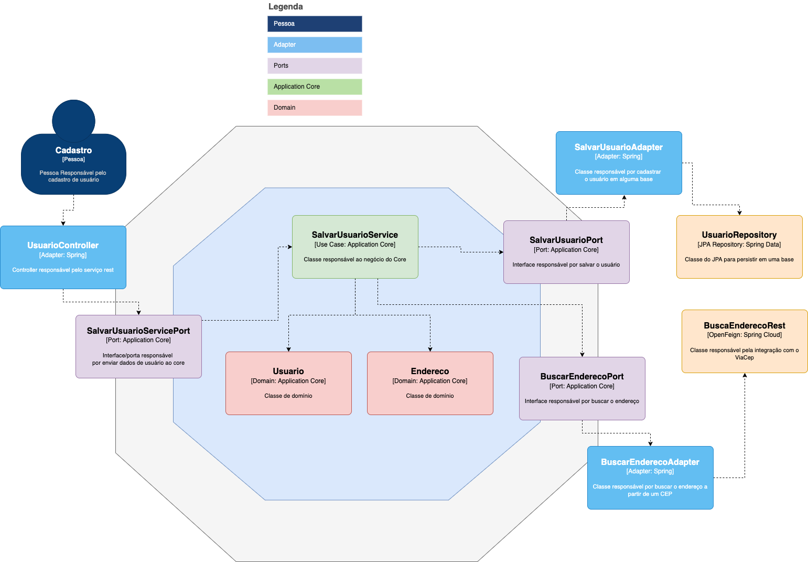

# Exemplo de arquitetura Hexagonal feita em Spring

Projeto feito em curso sobre a Arquitetura Hexagonal do professor [Nataniel Paiva](https://github.com/natanielpaiva)

## Para rodar a app na sua máquina

Execute esse comando em sua IDE ou linha de comando preferida:
```shell script
mvn spring-boot:run
```
Veja a imagem de como está feita essa arquitetura em uma visão de componentes do C4 model



Veja os repos originais abaixo (em Quarkus e Spring):
- https://github.com/natanielpaiva/arquitetura-hexagonal
- https://github.com/natanielpaiva/arquitetura-hexagonal-spring
